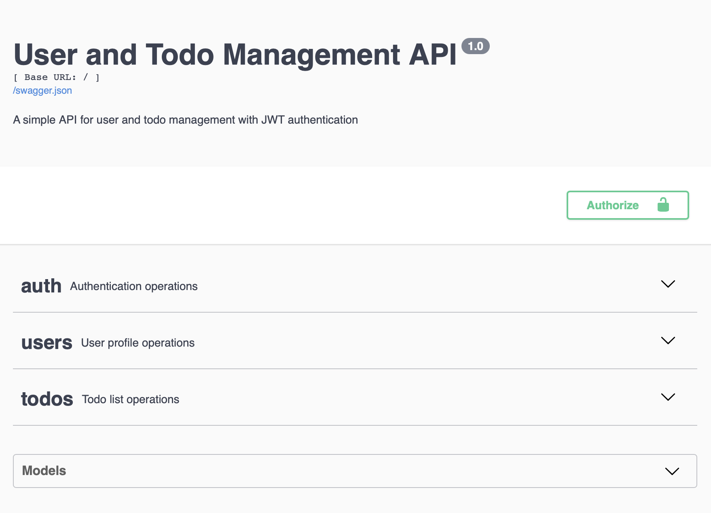

# 간단한 사용자 및 할 일 관리 API

## 설명
이 프로젝트는 사용자 및 할 일 목록을 관리하기 위한 간단한 API를 구현합니다. 데이터 지속성을 위해 인메모리 데이터베이스를 사용하므로, 외부 데이터베이스 구성 없이 쉽게 설정하고 실행할 수 있습니다. 인증은 JWT(JSON 웹 토큰)를 통해 처리됩니다.

## 기능
*   **사용자 관리**: 새로운 사용자 등록, 로그인, 사용자별 정보 접근 및 수정/삭제.
*   **할 일 관리**: 인증된 사용자와 관련된 할 일 항목 생성, 조회, 업데이트, 삭제.
*   **인메모리 데이터베이스**: 모든 데이터는 메모리에 저장되며, 애플리케이션 재시작 시 초기화됩니다.
*   **JWT 인증**: 토큰 기반 인증을 사용하여 API 엔드포인트를 보호합니다.

## 기술 스택
*   **Python**: 프로그래밍 언어
*   **Flask**: 웹 프레임워크
*   **Flask-RESTx**: Flask에 REST API 구축을 위한 지원을 추가하는 확장.
*   **Flask-JWT-Extended**: Flask 애플리케이션에 JWT 지원을 추가하는 Flask 확장.

## 설정 지침

1.  **저장소 복제**:
    ```bash
    git clone <repository_url>
    cd v3 # 또는 프로젝트 디렉토리 이름
    ```

2.  **가상 환경 생성 및 활성화**:
    ```bash
    python3 -m venv venv
    source venv/bin/activate
    ```

3.  **의존성 설치**:
    ```bash
    pip install -r requirements.txt
    ```

## 애플리케이션 실행

1.  **가상 환경이 활성화되어 있는지 확인**:
    ```bash
    source venv/bin/activate
    ```

2.  **Flask 애플리케이션 실행**:
    ```bash
    python app.py
    ```
    애플리케이션은 일반적으로 `http://127.0.0.1:5000/`에서 실행됩니다.

## API 문서 (Swagger UI)

애플리케이션이 실행 중일 때, 다음 주소에서 Swagger UI를 통해 API 문서를 확인할 수 있습니다:

[http://127.0.0.1:5000/swagger-ui](http://127.0.0.1:5000/swagger-ui)



## API 엔드포인트

### 인증 (Auth)

#### 1. 사용자 등록
*   **엔드포인트**: `POST /auth/signup`
*   **설명**: 새로운 사용자를 등록합니다.
*   **요청 본문**:
    ```json
    {
        "username": "your_username",
        "password": "your_password"
    }
    ```
*   **응답**:
    ```json
    {
        "message": "User created successfully",
        "user_id": "new_user_id"
    }
    ```
    *   `409 Conflict` (Username already exists) 응답 가능.

#### 2. 사용자 로그인
*   **엔드포인트**: `POST /auth/login`
*   **설명**: 기존 사용자로 로그인하고 액세스 토큰을 반환합니다. 이 토큰은 보호된 엔드포인트에 접근하는 데 사용되어야 합니다.
*   **요청 본문**:
    ```json
    {
        "username": "your_username",
        "password": "your_password"
    }
    ```
*   **응답**:
    ```json
    {
        "access_token": "eyJ..."
    }
    ```
    *   `401 Unauthorized` (Invalid username or password) 응답 가능.

#### 액세스 토큰 사용 방법:
로그인 후 `access_token`을 받게 됩니다. 이 토큰을 보호된 모든 엔드포인트에 대한 후속 요청의 `Authorization` 헤더에 `Bearer <access_token>` 형식으로 포함해야 합니다.

**`curl`을 사용한 예시**:
```bash
curl -X GET \
  -H "Authorization: Bearer eyJ..." \
  http://127.0.0.1:5000/users/your_user_id
```

### 사용자 관리 (Users)

#### 1. 모든 사용자 목록 조회
*   **엔드포인트**: `GET /users/`
*   **설명**: 시스템에 등록된 모든 사용자 목록을 조회합니다.
*   **인증**: 필요 없음.
*   **응답**:
    ```json
    [
        {
            "id": "user_id_1",
            "username": "user1",
            "email": "user1@example.com",
            "created_at": "timestamp",
            "updated_at": "timestamp"
        },
        {
            "id": "user_id_2",
            "username": "user2",
            "email": "user2@example.com",
            "created_at": "timestamp",
            "updated_at": "timestamp"
        }
    ]
    ```

#### 2. 특정 사용자 정보 조회 (보호됨)
*   **엔드포인트**: `GET /users/<user_id>`
*   **설명**: 특정 `user_id`를 가진 사용자의 정보를 조회합니다. **본인의 프로필만 조회 가능합니다.**
*   **인증**: 유효한 JWT 액세스 토큰이 필요합니다.
*   **응답**:
    ```json
    {
        "id": "user_id",
        "username": "your_username",
        "email": "your_email@example.com",
        "created_at": "timestamp",
        "updated_at": "timestamp"
    }
    ```
    *   `404 Not Found` (User not found) 응답 가능.
    *   `403 Forbidden` (You can only access your own profile) 응답 가능.

#### 3. 특정 사용자 정보 업데이트 (보호됨)
*   **엔드포인트**: `PUT /users/<user_id>`
*   **설명**: 특정 `user_id`를 가진 사용자의 정보를 업데이트합니다. **본인의 프로필만 업데이트 가능합니다.**
*   **인증**: 유효한 JWT 액세스 토큰이 필요합니다.
*   **요청 본문**:
    ```json
    {
        "username": "new_username",
        "email": "new_email@example.com"
    }
    ```
    *   `username`과 `email` 필드는 선택 사항이며, 제공된 필드만 업데이트됩니다.
*   **응답**:
    ```json
    {
        "id": "user_id",
        "username": "new_username",
        "email": "new_email@example.com",
        "created_at": "timestamp",
        "updated_at": "timestamp"
    }
    ```
    *   `404 Not Found` (User not found) 응답 가능.
    *   `403 Forbidden` (You can only update your own profile) 응답 가능.

#### 4. 특정 사용자 삭제 (보호됨)
*   **엔드포인트**: `DELETE /users/<user_id>`
*   **설명**: 특정 `user_id`를 가진 사용자를 삭제합니다. **본인의 프로필만 삭제 가능합니다.**
*   **인증**: 유효한 JWT 액세스 토큰이 필요합니다.
*   **응답**: `204 No Content` (성공적으로 삭제됨)
    *   `404 Not Found` (User not found) 응답 가능.
    *   `403 Forbidden` (You can only delete your own profile) 응답 가능.

### 할 일 관리 (Todos)

모든 할 일 엔드포인트는 유효한 JWT 액세스 토큰이 필요합니다.

#### 1. 할 일 생성
*   **엔드포인트**: `POST /todos/`
*   **설명**: 인증된 사용자를 위한 새로운 할 일 항목을 생성합니다.
*   **인증**: 유효한 JWT 액세스 토큰이 필요합니다.
*   **요청 본문**:
    ```json
    {
        "description": "새로운 할 일 내용",
        "status": "pending" 
    }
    ```
    *   `status`는 선택 사항이며, 기본값은 `pending`입니다. (`pending`, `completed` 등)
*   **응답**:
    ```json
    {
        "id": "todo_id",
        "user_id": "authenticated_user_id",
        "description": "새로운 할 일 내용",
        "status": "pending",
        "created_at": "timestamp",
        "updated_at": "timestamp"
    }
    ```
    *   `201 Created` (성공적으로 생성됨) 응답.

#### 2. 모든 할 일 가져오기
*   **엔드포인트**: `GET /todos/`
*   **설명**: 인증된 사용자의 모든 할 일 항목을 검색합니다.
*   **인증**: 유효한 JWT 액세스 토큰이 필요합니다.
*   **응답**:
    ```json
    [
        {
            "id": "todo_id_1",
            "user_id": "authenticated_user_id",
            "description": "첫 번째 할 일",
            "status": "pending",
            "created_at": "timestamp",
            "updated_at": "timestamp"
        },
        {
            "id": "todo_id_2",
            "user_id": "authenticated_user_id",
            "description": "두 번째 할 일",
            "status": "completed",
            "created_at": "timestamp",
            "updated_at": "timestamp"
        }
    ]
    ```

#### 3. 특정 할 일 가져오기
*   **엔드포인트**: `GET /todos/<todo_id>`
*   **설명**: ID로 단일 할 일 항목을 검색합니다. **본인이 생성한 할 일만 조회 가능합니다.**
*   **인증**: 유효한 JWT 액세스 토큰이 필요합니다.
*   **응답**:
    ```json
    {
        "id": "todo_id",
        "user_id": "authenticated_user_id",
        "description": "특정 할 일 내용",
        "status": "pending",
        "created_at": "timestamp",
        "updated_at": "timestamp"
    }
    ```
    *   `404 Not Found` (Todo not found or you don't have permission.) 응답 가능.

#### 4. 할 일 업데이트
*   **엔드포인트**: `PUT /todos/<todo_id>`
*   **설명**: 기존 할 일 항목을 업데이트합니다. **본인이 생성한 할 일만 업데이트 가능합니다.**
*   **인증**: 유효한 JWT 액세스 토큰이 필요합니다.
*   **요청 본문**:
    ```json
    {
        "description": "업데이트된 할 일 내용",
        "status": "completed"
    }
    ```
    *   `description`과 `status` 필드는 선택 사항이며, 제공된 필드만 업데이트됩니다.
*   **응답**:
    ```json
    {
        "id": "todo_id",
        "user_id": "authenticated_user_id",
        "description": "업데이트된 할 일 내용",
        "status": "completed",
        "created_at": "timestamp",
        "updated_at": "timestamp"
    }
    ```
    *   `404 Not Found` (Todo not found or you don't have permission.) 응답 가능.

#### 5. 할 일 삭제
*   **엔드포인트**: `DELETE /todos/<todo_id>`
*   **설명**: 할 일 항목을 삭제합니다. **본인이 생성한 할 일만 삭제 가능합니다.**
*   **인증**: 유효한 JWT 액세스 토큰이 필요합니다.
*   **응답**: `204 No Content` (성공적으로 삭제됨)
    *   `404 Not Found` (Todo not found or you don't have permission.) 응답 가능.

## 테스트
유닛 테스트를 실행하려면 `pytest`를 사용하세요:
```bash
pytest
```